vscode同步配置

> 随着编辑工具使用时间的增加，会出现越来越多的个性配置，如果更换电脑，如何快速的同步这些配置呢？

通过这个插件，我们就可以十分快捷的实现这个功能，你要做的事只有：

1. 下载插件
2. 有github账号
3. 上传配置 `shift+alt+u`
4. 下载配置 `shift+alt+d`

## 配置上传 - 第一次

完成插件安装之后，第一次会进入到这个页面

如果不小心关闭了，快捷键是`shift+alt+u`

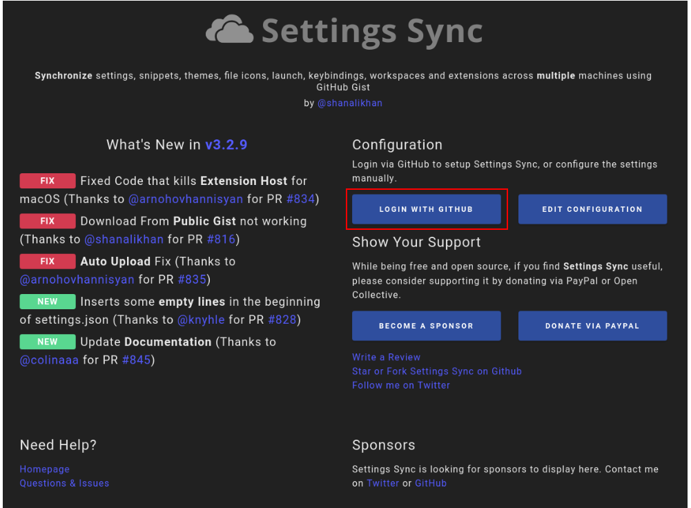

1. 点击 `login with github`,上图标红部分
2. 在打开的浏览器窗口中登陆github
3. 如果是第一次上传，会自动设置gist并提示配置完成
4. 如果曾经已经上传过会提示选择需要同步的配置

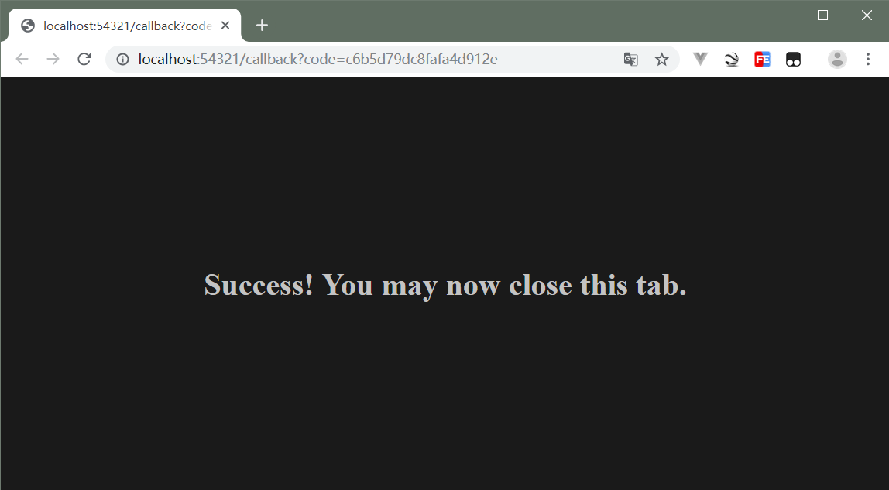

浏览器出现如图提示即可关闭浏览器返回vscode

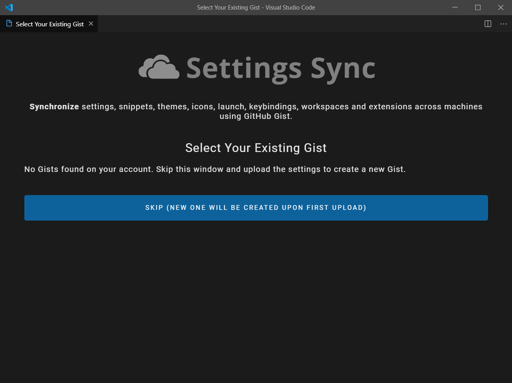

因为是第一次，中间的蓝色按钮创建一个新的gist，并完成此次上传

稍等片刻之后就会出现如下对话框,到此配置上传完毕

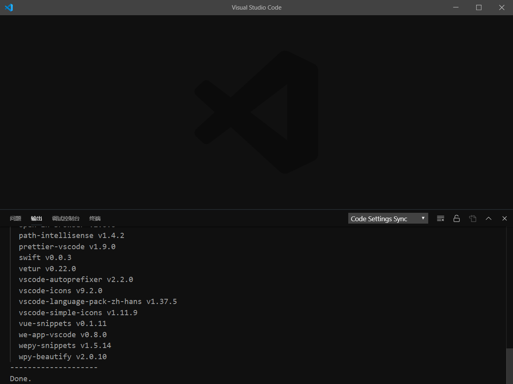

## 配置下载 - 第一次

> 更换电脑之后想要同步在另外一台电脑上上传的配置，步骤和上传类似

完成插件安装之后，第一次会进入到这个页面

如果不小心关闭了，快捷键是`shift+alt+d`

1. 点击 `login with github`,上图标红部分
2. 在打开的浏览器窗口中登陆github

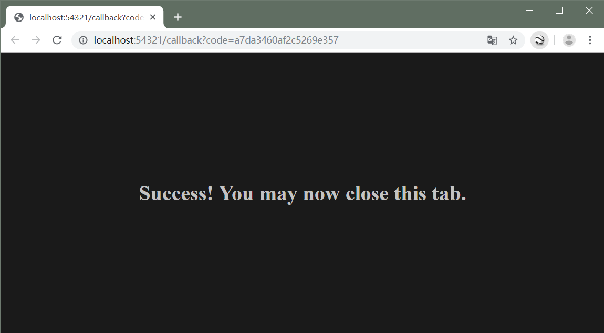

浏览器提示如此，说明登陆成功，这时返回到vscode中

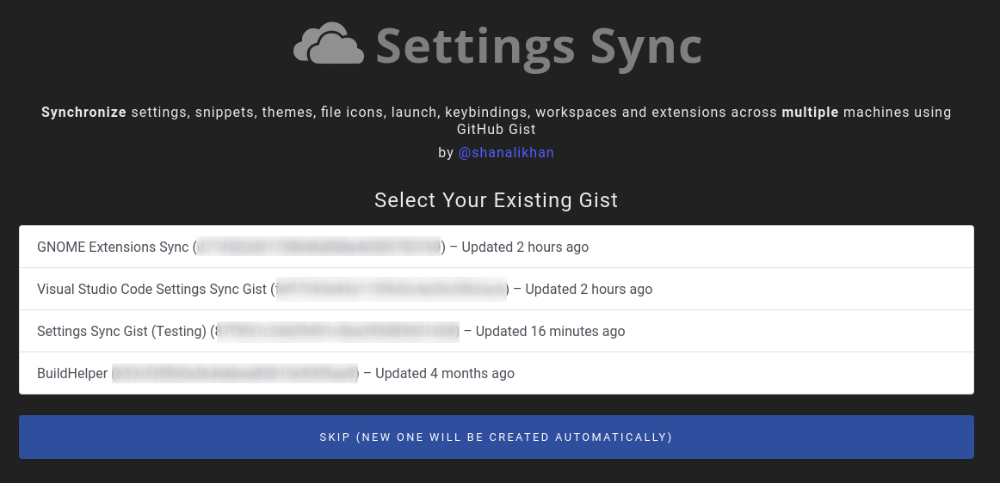

如果显示如图说明读取成功github保存的配置，选择对应的即可完成下载

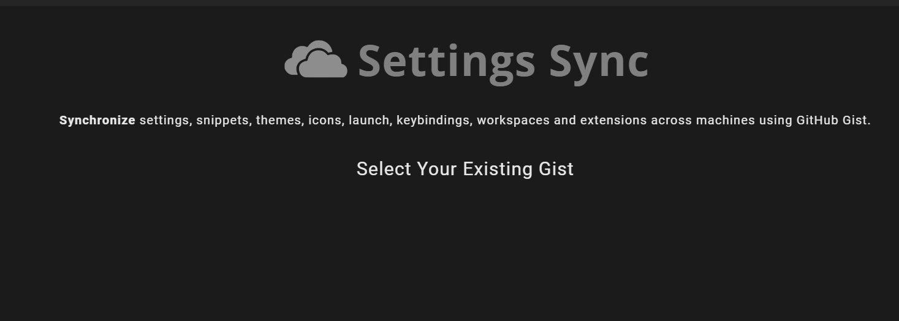

如果显示如图说明读取失败 可以人为的进行下载

## 配置下载 - 手动输入gist

> 如果第二步中无法读取到github中保存的gist 可以使用人为的方式来获取gist

### 电脑1

1. 上传配置的电脑1中 打开vscode
2. `ctrl+shift+p`输入sync 找到
3. 先找到高级选项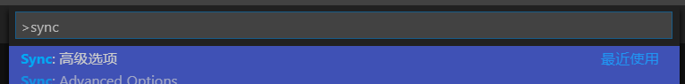
4. 再找到sync打开设置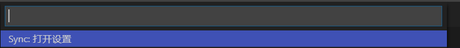
5. 拷贝 这里的gistid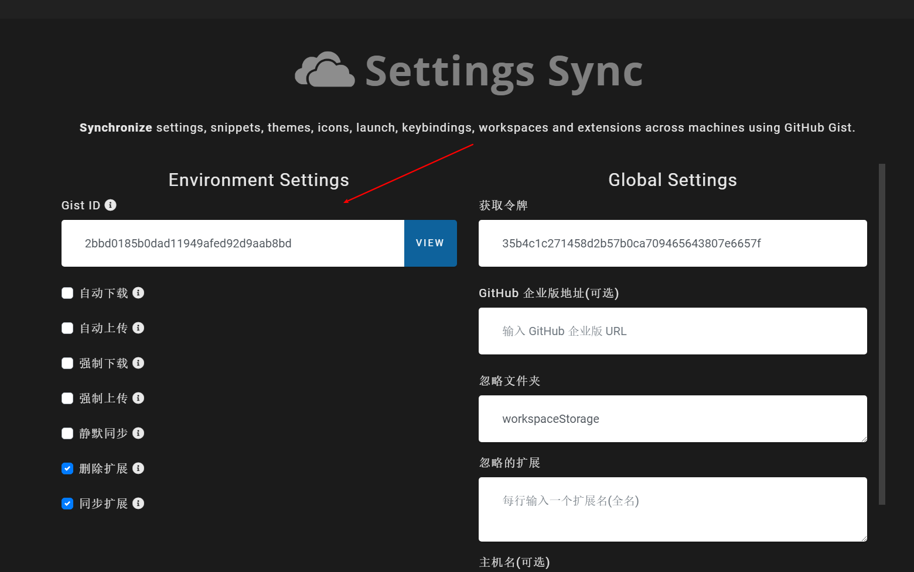

### 电脑2

> 接下来的操作在需要下载配置的电脑2中

1. 打开vscode
2. `shift+alt+d`

1. 点击 `login with github`,上图标红部分
2. 在打开的浏览器窗口中登陆github

浏览器提示如此，说明登陆成功，这时返回到vscode中

1. `ctrl+shift+p`输入sync 找到

2. 先找到高级选项

3. 再找到sync打开设置

4. 把从电脑1中拷贝的gistid拷贝到这里

   

5. `shift+alt+d`稍等片刻即可完成下载，下载完毕之后，重启vscode即可

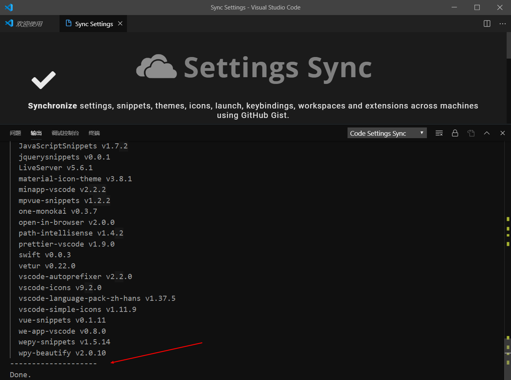

## 配置下载 - 从公开的gistid

> 如果自己没有上传任何的配置，想要使用别人的，也是支持的

1. 进入vscode安装插件
2. ctrl+shift+p`输入sync 找到
3. 先找到高级选项
4. 再找到sync打开设置
5. 把别人提供的gistid拷贝到下图Gistid处，同时勾选 下载公开gist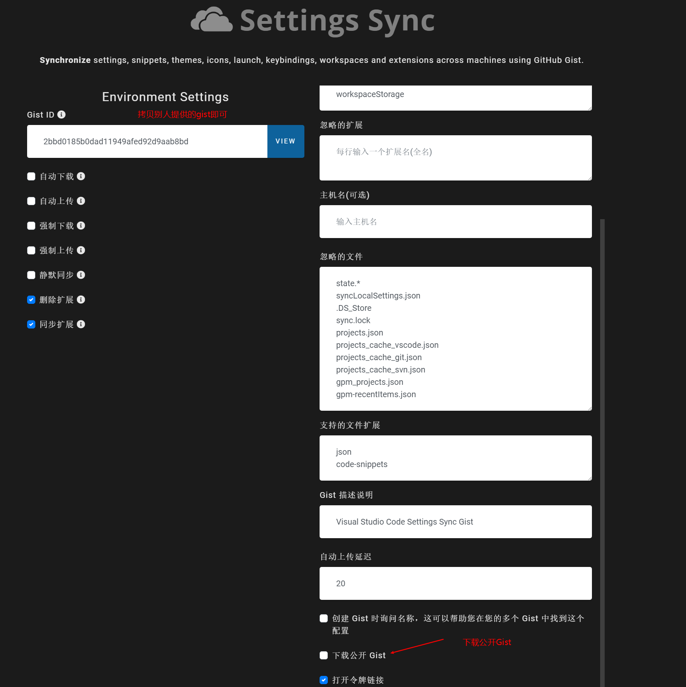
6. `shift+alt+d`稍等片刻即可完成下载，根据提示重启即可

